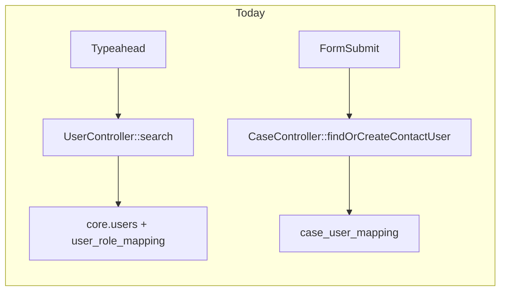
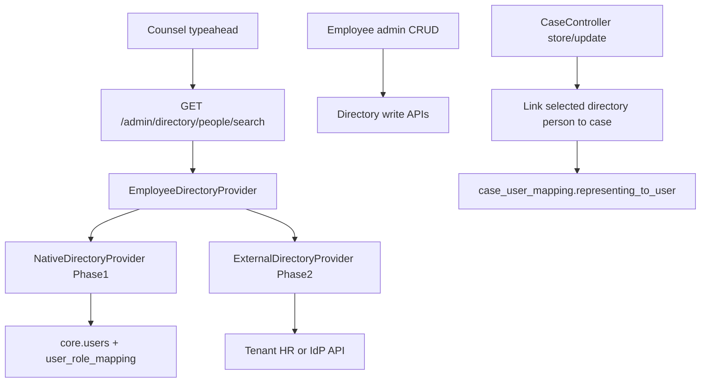
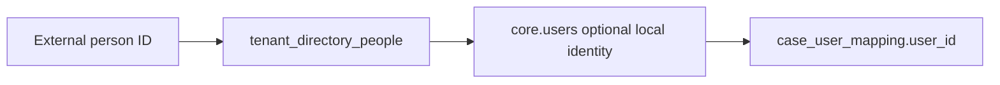

# Counsel ↔ Employee Directory Integration (Hybrid SaaS)

This document describes how counsel selection should integrate with a tenant employee directory in Share Fair, and how that can later connect to each tenant’s external HR / identity system.

**Status:** design only (not implemented)  
**Approach:** hybrid — use Share Fair’s internal employee directory first, then add per-tenant external HR providers without rewriting case-party flows.

---

## Summary

When adding counsel for the Client or Spouse, the picker should search a **tenant-scoped employee directory**, not treat counsel as a free-form contact that happens to share a typeahead.

Recommended pattern:

1. Treat **Employee Directory** as a platform service (search + write), separate from case-party save logic.
2. **Phase 1:** counsel typeahead searches Share Fair’s native roster (`EMP` / `LEGAL_RE` for the current tenant).
3. **Phase 2:** each tenant can plug in Azure AD, Workday, Google Workspace, etc. behind the same interface.
4. Case history always stores `users.id` on `case_user_mapping`. External HR IDs are linked through a shadow table, never written directly onto cases.

---

## Current state

Counsel selection already uses a typeahead, but it is **not** a dedicated employee-directory integration.

| Layer | Current implementation |
|-------|------------------------|
| UI | [`public/backend-assets/js/case-parties-form.js`](../public/backend-assets/js/case-parties-form.js), [`resources/views/backend/cases/partials/case-party-block.blade.php`](../resources/views/backend/cases/partials/case-party-block.blade.php) |
| Search API | `GET /admin/users/search` in [`app/Http/Controllers/backend/UserController.php`](../app/Http/Controllers/backend/UserController.php) |
| Data source | Local `core.users` joined to `core.user_role_mapping`, filtered by logged-in `tenant_id` and roles `EMP \| LEGAL_RE \| TENANT_A` |
| Save path | [`CaseController::findOrCreateContactUser()`](../app/Http/Controllers/backend/CaseController.php) resolves or creates a global user, then writes `case_user_mapping` with `representing_to_user` for client/spouse counsel |

**Gaps**

- Employee admin (`/admin/users`, role `EMP` only) and the counsel picker (broader role set) are related but not unified.
- All party blocks (Client, Spouse, counsel) share the same search endpoint.
- Counsel blocks allow free-text create, which bypasses the employee directory.



---

## Recommended SaaS pattern

Treat **Employee Directory** as a tenant-scoped platform service, not as case-form logic.



### Design principles

1. **Tenant boundary first** — every directory query is scoped by `tenant_id` from [`AdminContext`](../app/Support/AdminContext.php), never by client input alone.
2. **Directory vs case participant separation**
   - Directory answers: “Who works for this firm and can be counsel?”
   - Case mapping answers: “Who represents Client/Spouse on this case?” (`representing_to_user` stays on `case_user_mapping`)
3. **Select, don’t silently sync** — choosing counsel references a directory person explicitly; do not auto-create users from external HR without user action.
4. **Stable external linkage** — store `external_person_id` + `source_system` on the tenant membership record so re-sync does not break case history.
5. **Provider abstraction** — one interface, multiple backends per tenant config.

---

## Phase 1: Internal Share Fair employee directory

**Goal:** counsel picker reliably searches the tenant’s employee / legal roster already in Share Fair.

### 1. Directory service layer

Add:

- `app/Contracts/EmployeeDirectoryProvider.php`
- `app/Services/Directory/NativeEmployeeDirectoryProvider.php`
- `app/Services/Directory/EmployeeDirectoryService.php`

Move search logic out of `UserController::search()`. The controller becomes a thin JSON endpoint.

**Native provider query rules (counsel-specific)**

- Scope: `user_role_mapping.tenant_id = current tenant`
- Active only: `users.is_active = true`, `user_role_mapping.is_active = true`
- Counsel-eligible roles: start with `LEGAL_RE` + `EMP`; optionally include `TENANT_A` behind a flag
- Search fields: name, email, phone

**Normalized DTO**

```json
{
  "id": "native:123",
  "user_id": 123,
  "display_name": "Jane Doe",
  "email": "jane@firm.com",
  "phone": "+1...",
  "role": "LEGAL_RE",
  "source": "native"
}
```

### 2. Split counsel search from client/spouse search

Today all party blocks share one endpoint. Better UX:

| Party block | Directory filter |
|-------------|------------------|
| Client / Spouse | External contacts only (manual entry + optional future client portal lookup) |
| Client counsel / Spouse counsel | `counselEligible=true` directory search |
| Additional counsel | Same counsel filter |

**Preferred route:** `GET /admin/directory/people/search?purpose=counsel`

Keep existing `/admin/users/search` temporarily as an alias for backward compatibility.

Update [`resources/views/backend/cases/partials/case-parties-form.blade.php`](../resources/views/backend/cases/partials/case-parties-form.blade.php) so counsel blocks pass `data-search-purpose="counsel"`.

### 3. Tighten save behavior for counsel rows

In [`CaseController`](../app/Http/Controllers/backend/CaseController.php), for counsel slots (`LEGAL_RE` with `represents_party`):

- If `user_id` is present → use the existing directory user (current behavior).
- If `user_id` is missing → allow create only when tenant policy permits external counsel.

Add a tenant setting later: `allow_external_counsel_manual_entry` (default `true` initially so current flows do not break).

Happy path becomes: **pick from employees / legal reps**.

### 4. Align employee admin with directory

[`UserController::index/store/update`](../app/Http/Controllers/backend/UserController.php) remains the write path for native employees (`EMP`).

Enhancements:

- Creating or updating an employee makes them immediately searchable by the counsel picker.
- Optional metadata for counsel eligibility (e.g. `is_counsel_eligible`, bar number) on `user_role_mapping` or a small `tenant_person_profile` table.

Do **not** duplicate people in a second employees table unless HR sync requires it.

---

## Phase 2: External HR / identity per tenant

**Goal:** each tenant can connect their own system without changing case UI or case save semantics.

### 1. Tenant integration config

Add tenant-scoped config (table or JSON on `tenants`):

| Field | Example |
|-------|---------|
| `directory_provider` | `native`, `azure_ad`, `workday`, `google` |
| `directory_config` | Encrypted OAuth / client credentials |
| `sync_mode` | `search_federated`, `scheduled_sync`, `webhook` |
| `last_synced_at` | Audit timestamp |

### 2. External provider implementations

Implement `ExternalEmployeeDirectoryProvider` variants behind the same contract:

| Mode | Best for | Behavior |
|------|----------|----------|
| Federated search | Typeahead | Query HR API live; cache 5–15 min per tenant/query |
| Scheduled sync | Reliability | Nightly/hourly import into shadow records |
| Webhook / SCIM | Freshness | Upsert on change events |

**Recommended default for counsel picker:** federated search + nightly reconciliation.

### 3. Shadow / link model

Do **not** make `case_user_mapping.user_id` point directly at external IDs.



Suggested table `tenant_directory_people`:

| Column | Purpose |
|--------|---------|
| `tenant_id` | Tenant scope |
| `source_system` | `native`, `azure_ad`, etc. |
| `external_person_id` | Stable ID in the source system |
| `user_id` | Nullable FK → `users.id` |
| cached `display_name`, `email`, `phone`, `is_counsel_eligible` | Typeahead fields |
| `last_synced_at` | Reconciliation |

Case save continues to use `users.id`; sync jobs maintain the link.

### 4. Security and compliance

- Store OAuth secrets encrypted per tenant.
- Audit log: who searched the directory, who assigned counsel.
- Data minimization: counsel picker only needs name / email / phone / role, not the full HR payload.
- Hard fallback: if the external provider fails, fall back to `NativeEmployeeDirectoryProvider`.

---

## API and UI changes (Phase 1)

### API

- `GET /admin/directory/people/search?q=&purpose=counsel|employee`
- Optional: `GET /admin/directory/people/{id}` for a detail panel

### UI

- Counsel search label: **Search firm employee or legal representative**
- Later: source badge (`Share Fair`, `Workday`) when external providers exist
- Keep manual entry as a secondary action, not the primary path

No change to [`representing_to_user`](../app/Models/CaseUserMapping.php) semantics.

---

## Why this is the best SaaS approach

| Approach | Pros | Cons |
|----------|------|------|
| Query `users` directly in the case form (today) | Simple | Hard to add HR providers; counsel/employee rules mixed |
| Separate employees table only for counsel | Clear counsel list | Duplicates identity; conflicts with global email/phone uniqueness |
| **Directory provider + linked user model (recommended)** | Tenant-configurable, phased, preserves case history | Small upfront abstraction cost |

Phase 1 delivers immediate value using existing `EMP` / `LEGAL_RE` data. Phase 2 adds per-tenant HR connectors without rewriting [`case-parties-form.js`](../public/backend-assets/js/case-parties-form.js) or case save logic.

---

## Implementation order

1. Add `EmployeeDirectoryProvider` + native implementation; route counsel search through it.
2. Counsel-only search filter + UI copy / search URL split for counsel blocks.
3. Optional `tenant_directory_people` schema stub (nullable until Phase 2).
4. Tenant integration settings + first external provider (likely Azure AD or CSV import).
5. Sync / reconciliation jobs + fallback behavior.

---

## Out of scope

Unless explicitly requested later:

- Removing manual counsel entry entirely
- Client / Spouse lookup from an external CRM
- Cross-tenant user sharing changes (global `users.email` uniqueness remains a platform constraint)

---

## Related code

| Area | Path |
|------|------|
| Counsel typeahead JS | [`public/backend-assets/js/case-parties-form.js`](../public/backend-assets/js/case-parties-form.js) |
| Party / counsel form partial | [`resources/views/backend/cases/partials/case-parties-form.blade.php`](../resources/views/backend/cases/partials/case-parties-form.blade.php) |
| Party block | [`resources/views/backend/cases/partials/case-party-block.blade.php`](../resources/views/backend/cases/partials/case-party-block.blade.php) |
| User search | [`app/Http/Controllers/backend/UserController.php`](../app/Http/Controllers/backend/UserController.php) (`search()`) |
| Case party save | [`app/Http/Controllers/backend/CaseController.php`](../app/Http/Controllers/backend/CaseController.php) |
| Tenant context | [`app/Support/AdminContext.php`](../app/Support/AdminContext.php) |
| Case participant mapping | [`app/Models/CaseUserMapping.php`](../app/Models/CaseUserMapping.php) |
